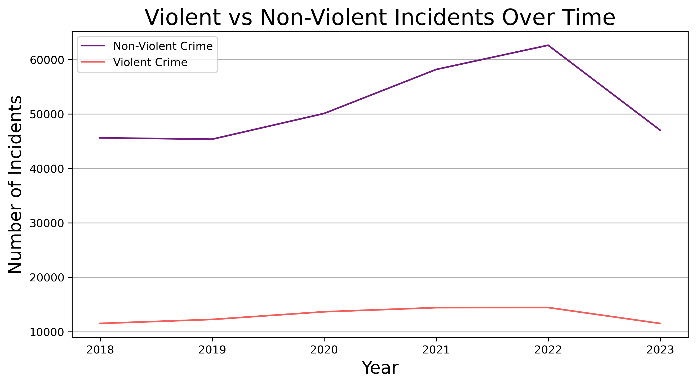
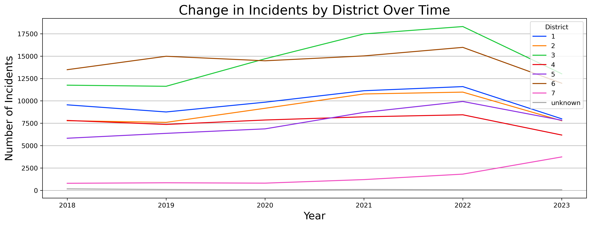

# Denver-Crime-Data-Analysis
Investigative data analysis of public Denver crime data from Kaggle.

## Analytic Questions & Related Visualizations

### Categorical Comparisons with Bar Charts

#### What is the breakdown of incidents by offense category?

#### What is the breakdown of incidents by district *and* offense category?

### Temporal Trends with Line Charts

#### How have incidents changed over time?

#### How have violent vs non-violent incidents changed over time?

#### How have incidents by district changed over time?

### Distribution with Histograms

#### When do most incidents occur by hour?

#### When do most incidents occur by month?

### Correlation with Scatterplots

#### Is there a correlation between incidents and distance from city center?

### Geographic Distribution with Chloropleths

#### What is the geographic distribution of violent incidents by neighborhood?

#### What about the geographic distribution of non-violent incidents by neighborhood?
